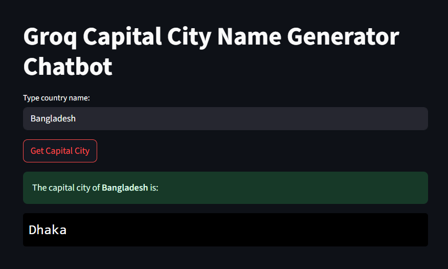

# Groq-Capital-City-Name-Generator-Chatbot


## About
This is a streamlit webApp where you can input any country name and it will show the capital city of that country through Groq LLM using Langchain_Groq
```
Streamlit->Input->Groq->Response->Streamlit->Output
```

## Get and Setup Groq API key
Create a python file like secret_key.py. 
Then:

```
Go to groq.com -> Developers -> Free API key -> Create API Key -> copy key
```

Go to your secret_key.py and type:

```
key="gsk-.......enter your key......."
```

I am not sharing the secret_key.py in assets for confidentiality.

## Streamlit app
I integrated the whole code in a single app.py file
I used "openai/gpt-oss-120b" model as llm where you can use many others like llama,deepseek etc.
I used the tricks to prompt the dynamic country name as variable in the promp:

```
question=f"what is the capital city of {CountryName}? Give me single answer"
```

The single answer was prompted for a good and clean capital city name response.
Check assets in the repository for whole code.

